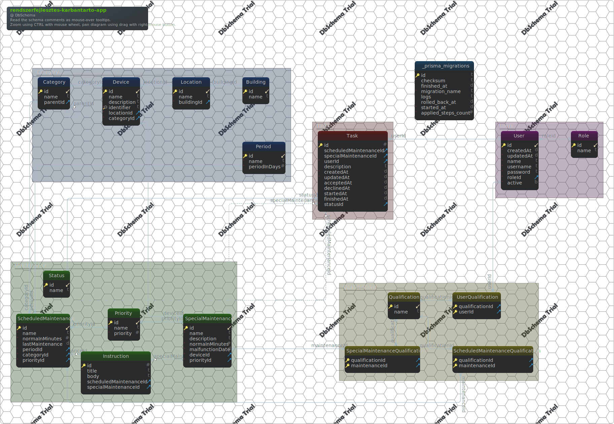

#rendszerfejlesztes-karbantarto-app
Generated using [DbSchema](https://dbschema.com)

<a name='layout1'>### Main Layout

### Table Building 
| Idx | Field Name | Data Type |
|---|---|---|
| *🔑 ⬋ | <a name='Default.Building_id'>id</a>| integer AUTOINCREMENT |
| *| <a name='Default.Building_name'>name</a>| text  |
| Indexes |
| 🔑 | pk&#95;Building || ON id|

### Table Category 
| Idx | Field Name | Data Type |
|---|---|---|
| *🔑 ⬋ | <a name='Default.Category_id'>id</a>| integer AUTOINCREMENT |
| *| <a name='Default.Category_name'>name</a>| text  |
| ⬈ | <a name='Default.Category_parentId'>parentId</a>| integer  |
| Indexes |
| 🔑 | pk&#95;Category || ON id|
| Foreign Keys |
|  | Category_parentId_fkey | ( parentId ) ref [Default&#46;Category](#Category) (id) |

### Table Device 
| Idx | Field Name | Data Type |
|---|---|---|
| *🔑 ⬋ | <a name='Default.Device_id'>id</a>| integer AUTOINCREMENT |
| *| <a name='Default.Device_name'>name</a>| text  |
|  | <a name='Default.Device_description'>description</a>| text  |
| *🔍 | <a name='Default.Device_identifier'>identifier</a>| text  |
| *⬈ | <a name='Default.Device_locationId'>locationId</a>| integer  |
| *⬈ | <a name='Default.Device_categoryId'>categoryId</a>| integer  DEFAULT 1 |
| Indexes |
| 🔑 | pk&#95;Device || ON id|
| 🔍  | Device&#95;identifier&#95;key || ON identifier|
| Foreign Keys |
|  | Device_locationId_fkey | ( locationId ) ref [Default&#46;Location](#Location) (id) |
|  | Device_categoryId_fkey | ( categoryId ) ref [Default&#46;Category](#Category) (id) |

### Table Instruction 
| Idx | Field Name | Data Type |
|---|---|---|
| *🔑 | <a name='Default.Instruction_id'>id</a>| integer AUTOINCREMENT |
| *| <a name='Default.Instruction_title'>title</a>| text  |
|  | <a name='Default.Instruction_body'>body</a>| text  |
| ⬈ | <a name='Default.Instruction_scheduledMaintenanceId'>scheduledMaintenanceId</a>| integer  |
| ⬈ | <a name='Default.Instruction_specialMaintenanceId'>specialMaintenanceId</a>| integer  |
| Indexes |
| 🔑 | pk&#95;Instruction || ON id|
| Foreign Keys |
|  | Instruction_scheduledMaintenanceId_fkey | ( scheduledMaintenanceId ) ref [Default&#46;ScheduledMaintenance](#ScheduledMaintenance) (id) |
|  | Instruction_specialMaintenanceId_fkey | ( specialMaintenanceId ) ref [Default&#46;SpecialMaintenance](#SpecialMaintenance) (id) |

### Table Location 
| Idx | Field Name | Data Type |
|---|---|---|
| *🔑 ⬋ | <a name='Default.Location_id'>id</a>| integer AUTOINCREMENT |
| *| <a name='Default.Location_name'>name</a>| text  |
| *⬈ | <a name='Default.Location_buildingId'>buildingId</a>| integer  |
| Indexes |
| 🔑 | pk&#95;Location || ON id|
| Foreign Keys |
|  | Location_buildingId_fkey | ( buildingId ) ref [Default&#46;Building](#Building) (id) |

### Table Period 
| Idx | Field Name | Data Type |
|---|---|---|
| *🔑 ⬋ | <a name='Default.Period_id'>id</a>| integer AUTOINCREMENT |
| *| <a name='Default.Period_name'>name</a>| text  |
| *| <a name='Default.Period_periodInDays'>periodInDays</a>| integer  |
| Indexes |
| 🔑 | pk&#95;Period || ON id|

### Table Priority 
| Idx | Field Name | Data Type |
|---|---|---|
| *🔑 ⬋ | <a name='Default.Priority_id'>id</a>| integer AUTOINCREMENT |
| *| <a name='Default.Priority_name'>name</a>| text  |
| *| <a name='Default.Priority_priority'>priority</a>| integer  |
| Indexes |
| 🔑 | pk&#95;Priority || ON id|

### Table Qualification 
| Idx | Field Name | Data Type |
|---|---|---|
| *🔑 ⬋ | <a name='Default.Qualification_id'>id</a>| integer AUTOINCREMENT |
| *| <a name='Default.Qualification_name'>name</a>| text  |
| Indexes |
| 🔑 | pk&#95;Qualification || ON id|

### Table Role 
| Idx | Field Name | Data Type |
|---|---|---|
| *🔑 ⬋ | <a name='Default.Role_id'>id</a>| integer AUTOINCREMENT |
| *| <a name='Default.Role_name'>name</a>| text  |
| Indexes |
| 🔑 | pk&#95;Role || ON id|

### Table ScheduledMaintenance 
| Idx | Field Name | Data Type |
|---|---|---|
| *🔑 ⬋ | <a name='Default.ScheduledMaintenance_id'>id</a>| integer AUTOINCREMENT |
| *| <a name='Default.ScheduledMaintenance_name'>name</a>| text  |
| *| <a name='Default.ScheduledMaintenance_normaInMinutes'>normaInMinutes</a>| integer  |
|  | <a name='Default.ScheduledMaintenance_lastMaintenance'>lastMaintenance</a>| datetime  |
| *⬈ | <a name='Default.ScheduledMaintenance_periodId'>periodId</a>| integer  |
| *⬈ | <a name='Default.ScheduledMaintenance_categoryId'>categoryId</a>| integer  DEFAULT 1 |
| *⬈ | <a name='Default.ScheduledMaintenance_priorityId'>priorityId</a>| integer  |
| Indexes |
| 🔑 | pk&#95;ScheduledMaintenance || ON id|
| Foreign Keys |
|  | ScheduledMaintenance_categoryId_fkey | ( categoryId ) ref [Default&#46;Category](#Category) (id) |
|  | ScheduledMaintenance_periodId_fkey | ( periodId ) ref [Default&#46;Period](#Period) (id) |
|  | ScheduledMaintenance_priorityId_fkey | ( priorityId ) ref [Default&#46;Priority](#Priority) (id) |

### Table ScheduledMaintenanceQualification 
| Idx | Field Name | Data Type |
|---|---|---|
| *🔑 ⬈ | <a name='Default.ScheduledMaintenanceQualification_qualificationId'>qualificationId</a>| integer  |
| *🔑 ⬈ | <a name='Default.ScheduledMaintenanceQualification_maintenanceId'>maintenanceId</a>| integer  |
| Indexes |
| 🔑 | pk&#95;ScheduledMaintenanceQualification || ON qualificationId&#44; maintenanceId|
| Foreign Keys |
|  | ScheduledMaintenanceQualification_maintenanceId_fkey | ( maintenanceId ) ref [Default&#46;ScheduledMaintenance](#ScheduledMaintenance) (id) |
|  | ScheduledMaintenanceQualification_qualificationId_fkey | ( qualificationId ) ref [Default&#46;Qualification](#Qualification) (id) |

### Table SpecialMaintenance 
| Idx | Field Name | Data Type |
|---|---|---|
| *🔑 ⬋ | <a name='Default.SpecialMaintenance_id'>id</a>| integer AUTOINCREMENT |
| *| <a name='Default.SpecialMaintenance_name'>name</a>| text  |
|  | <a name='Default.SpecialMaintenance_description'>description</a>| text  |
| *| <a name='Default.SpecialMaintenance_normaInMinutes'>normaInMinutes</a>| integer  |
| *| <a name='Default.SpecialMaintenance_malfunctionDate'>malfunctionDate</a>| datetime  DEFAULT CURRENT_TIMESTAMP |
| *⬈ | <a name='Default.SpecialMaintenance_deviceId'>deviceId</a>| integer  |
| *⬈ | <a name='Default.SpecialMaintenance_priorityId'>priorityId</a>| integer  |
| Indexes |
| 🔑 | pk&#95;SpecialMaintenance || ON id|
| Foreign Keys |
|  | SpecialMaintenance_deviceId_fkey | ( deviceId ) ref [Default&#46;Device](#Device) (id) |
|  | SpecialMaintenance_priorityId_fkey | ( priorityId ) ref [Default&#46;Priority](#Priority) (id) |

### Table SpecialMaintenanceQualification 
| Idx | Field Name | Data Type |
|---|---|---|
| *🔑 ⬈ | <a name='Default.SpecialMaintenanceQualification_qualificationId'>qualificationId</a>| integer  |
| *🔑 ⬈ | <a name='Default.SpecialMaintenanceQualification_maintenanceId'>maintenanceId</a>| integer  |
| Indexes |
| 🔑 | pk&#95;SpecialMaintenanceQualification || ON qualificationId&#44; maintenanceId|
| Foreign Keys |
|  | SpecialMaintenanceQualification_maintenanceId_fkey | ( maintenanceId ) ref [Default&#46;SpecialMaintenance](#SpecialMaintenance) (id) |
|  | SpecialMaintenanceQualification_qualificationId_fkey | ( qualificationId ) ref [Default&#46;Qualification](#Qualification) (id) |

### Table Status 
| Idx | Field Name | Data Type |
|---|---|---|
| *🔑 ⬋ | <a name='Default.Status_id'>id</a>| integer AUTOINCREMENT |
| *| <a name='Default.Status_name'>name</a>| text  |
| Indexes |
| 🔑 | pk&#95;Status || ON id|

### Table Task 
| Idx | Field Name | Data Type |
|---|---|---|
| *🔑 | <a name='Default.Task_id'>id</a>| integer AUTOINCREMENT |
| ⬈ | <a name='Default.Task_scheduledMaintenanceId'>scheduledMaintenanceId</a>| integer  |
| ⬈ | <a name='Default.Task_specialMaintenanceId'>specialMaintenanceId</a>| integer  |
| *⬈ | <a name='Default.Task_userId'>userId</a>| integer  |
|  | <a name='Default.Task_description'>description</a>| text  |
| *| <a name='Default.Task_createdAt'>createdAt</a>| datetime  DEFAULT CURRENT_TIMESTAMP |
| *| <a name='Default.Task_updatedAt'>updatedAt</a>| datetime  |
|  | <a name='Default.Task_acceptedAt'>acceptedAt</a>| datetime  |
|  | <a name='Default.Task_declinedAt'>declinedAt</a>| datetime  |
|  | <a name='Default.Task_startedAt'>startedAt</a>| datetime  |
|  | <a name='Default.Task_finishedAt'>finishedAt</a>| datetime  |
| *⬈ | <a name='Default.Task_statusId'>statusId</a>| integer  DEFAULT 1 |
| Indexes |
| 🔑 | pk&#95;Task || ON id|
| Foreign Keys |
|  | Task_scheduledMaintenanceId_fkey | ( scheduledMaintenanceId ) ref [Default&#46;ScheduledMaintenance](#ScheduledMaintenance) (id) |
|  | Task_specialMaintenanceId_fkey | ( specialMaintenanceId ) ref [Default&#46;SpecialMaintenance](#SpecialMaintenance) (id) |
|  | Task_userId_fkey | ( userId ) ref [Default&#46;User](#User) (id) |
|  | Task_statusId_fkey | ( statusId ) ref [Default&#46;Status](#Status) (id) |

### Table User 
| Idx | Field Name | Data Type |
|---|---|---|
| *🔑 ⬋ | <a name='Default.User_id'>id</a>| integer AUTOINCREMENT |
| *| <a name='Default.User_createdAt'>createdAt</a>| datetime  DEFAULT CURRENT_TIMESTAMP |
| *| <a name='Default.User_updatedAt'>updatedAt</a>| datetime  |
| *| <a name='Default.User_name'>name</a>| text  |
| *| <a name='Default.User_username'>username</a>| text  |
| *| <a name='Default.User_password'>password</a>| text  |
| *⬈ | <a name='Default.User_roleId'>roleId</a>| integer  |
| *| <a name='Default.User_active'>active</a>| boolean  |
| Indexes |
| 🔑 | pk&#95;User || ON id|
| Foreign Keys |
|  | User_roleId_fkey | ( roleId ) ref [Default&#46;Role](#Role) (id) |

### Table UserQualification 
| Idx | Field Name | Data Type |
|---|---|---|
| *🔑 ⬈ | <a name='Default.UserQualification_qualificationId'>qualificationId</a>| integer  |
| *🔑 ⬈ | <a name='Default.UserQualification_userId'>userId</a>| integer  |
| Indexes |
| 🔑 | pk&#95;UserQualification || ON qualificationId&#44; userId|
| Foreign Keys |
|  | UserQualification_userId_fkey | ( userId ) ref [Default&#46;User](#User) (id) |
|  | UserQualification_qualificationId_fkey | ( qualificationId ) ref [Default&#46;Qualification](#Qualification) (id) |

### Table _prisma_migrations 
| Idx | Field Name | Data Type |
|---|---|---|
| *🔑 | <a name='Default._prisma_migrations_id'>id</a>| text  |
| *| <a name='Default._prisma_migrations_checksum'>checksum</a>| text  |
|  | <a name='Default._prisma_migrations_finished_at'>finished&#95;at</a>| datetime  |
| *| <a name='Default._prisma_migrations_migration_name'>migration&#95;name</a>| text  |
|  | <a name='Default._prisma_migrations_logs'>logs</a>| text  |
|  | <a name='Default._prisma_migrations_rolled_back_at'>rolled&#95;back&#95;at</a>| datetime  |
| *| <a name='Default._prisma_migrations_started_at'>started&#95;at</a>| datetime  DEFAULT current_timestamp |
| *| <a name='Default._prisma_migrations_applied_steps_count'>applied&#95;steps&#95;count</a>| integer UNSIGNED  DEFAULT 0 |
| Indexes |
| 🔑 | pk&#95;&#95;prisma&#95;migrations || ON id|

